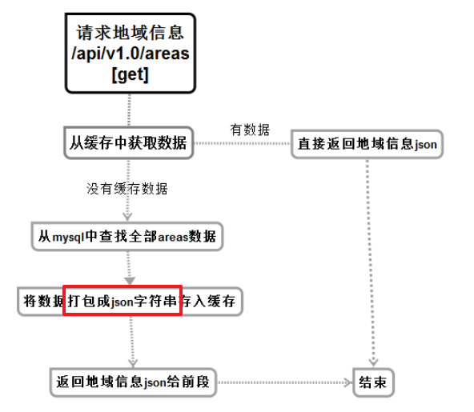
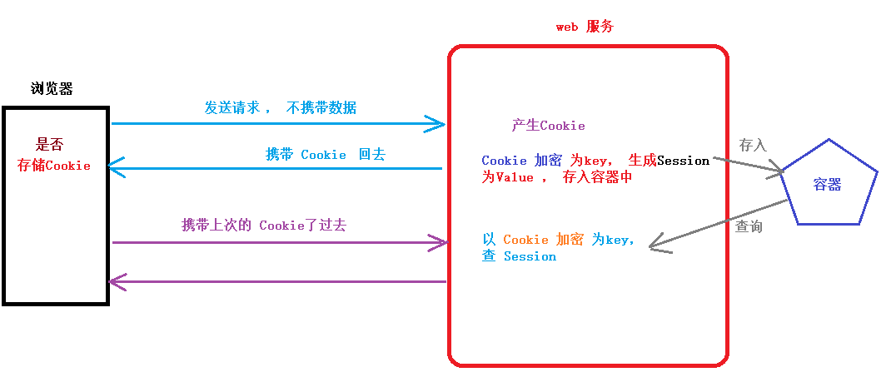

# 微服务实现 注册用户

## 微服务端

1.  修改密码本 —— proto 文件

    ```go
    syntax = "proto3";
    
    package go.micro.srv.user;
    
    service User {
    	rpc SendSms(Request) returns (Response) {};
    	rpc Register(RegReq) returns (Response) {};   // 注册用户
    }
    
    message RegReq {
        string mobile = 1;
        string password = 2;
        string sms_code = 3;
    }
    
    message Request {
    	string phone = 1;
    	string imgCode = 2;
    	string uuid = 3;
    }
    
    message Response {
    	string errno = 1;
    	string errmsg = 2;
    }
    ```

2. make 编译生成 xxx.micro.go 文件。

3. 修改 service/user/main.go    --- 没有需要修改的

4. 修改 handler/user.go 

    ```go
    // 添加 方法
    func (e *User) Register(ctx context.Context, req *user.RegReq, rsp *user.Response) error {
    	return nil
    }
    ```

5. 需要操作，MySQL数据库， 拷贝 web/model/model.go 到  微服务项目中。

6. 在 service/user/model/modelFunc.go 中 添加 校验短信验证码函数实现

    ```go
    // 校验短信验证码
    func CheckSmsCode(phone, code string) error {
    	// 链接redis
    	conn := RedisPool.Get()
    
    	// 从 redis 中, 根据 key 获取 Value --- 短信验证码  码值
    	smsCode, err := redis.String(conn.Do("get", phone+"_code"))
    	if err != nil {
    		fmt.Println("redis get phone_code err:", err)
    		return err
    	}
    	// 验证码匹配  失败
    	if smsCode != code {
    		return errors.New("验证码匹配失败!")
    	}
    	// 匹配成功!
    	return nil
    }
    ```

7.   service/user/model/modelFunc.go 中, 添加函数RegisterUser， 实现 用户注册信息，写入MySQL数据库

    ```go
    // 注册用户信息,写 MySQL 数据库.
    func RegisterUser(mobile, pwd string) error {
    	var user User
    	user.Name = mobile		// 默认使用手机号作为用户名
    
    	// 使用 md5 对 pwd 加密
    	m5 := md5.New()			// 初始md5对象
    	m5.Write([]byte(pwd))			// 将 pwd 写入缓冲区
    	pwd_hash := hex.EncodeToString(m5.Sum(nil))	// 不使用额外的秘钥
    
    	user.Password_hash = pwd_hash
    
    	// 插入数据到MySQL
    	return GlobalConn.Create(&user).Error
    }
    ```

8. 完成  Register  函数 实现

    ```go
    func (e *User) Register(ctx context.Context, req *user.RegReq, rsp *user.Response) error {
    	// 先校验短信验证码,是否正确. redis 中存储短信验证码.
    	err := model.CheckSmsCode(req.Mobile, req.SmsCode)
    	if err == nil {
    
    		// 如果校验正确. 注册用户. 将数据写入到 MySQL数据库.
    		err = model.RegisterUser(req.Mobile, req.Password)
    		if err != nil {
    			rsp.Errno = utils.RECODE_DBERR
    			rsp.Errmsg = utils.RecodeText(utils.RECODE_DBERR)
    		} else {
    			rsp.Errno = utils.RECODE_OK
    			rsp.Errmsg = utils.RecodeText(utils.RECODE_OK)
    		}
    	} else {  // 短信验证码错误
    		rsp.Errno = utils.RECODE_DATAERR
    		rsp.Errmsg = utils.RecodeText(utils.RECODE_DATAERR)
    	}
    	return nil
    }
    ```

    

## web 端

1.  拷贝密码本 ——proto

2.  创建 web/utils/utils.go 文件， 封装 函数实现 初始 consul 客户端代码

    ```go
    // 初始化micro
    func InitMicro() micro.Service {
    	// 初始化客户端
    	consulReg := consul.NewRegistry()
    	return micro.NewService(
    		micro.Registry(consulReg),
    	)
    }
    ```
    
3. 实现 web/controller/user.go 中的 PostRet 函数

    ```go
    // 发送注册信息
    func PostRet(ctx *gin.Context) {
    	// 获取数据
    	var regData struct {
    		Mobile   string `json:"mobile"`
    		PassWord string `json:"password"`
    		SmsCode  string `json:"sms_code"`
    	}
    	ctx.Bind(&regData)
    
    	// 初始化consul
    	microService := utils.InitMicro()
        
        // 初始化客户端
    	microClient := userMicro.NewUserService("go.micro.srv.user", microService.Client())
    
    	// 调用远程函数
    	resp, err := microClient.Register(context.TODO(), &userMicro.RegReq{
    		Mobile:regData.Mobile,
    		SmsCode:regData.SmsCode,
    		Password:regData.PassWord,
    	})
    	if err != nil {
    		fmt.Println("注册用户, 找不到远程服务!", err)
    		return
    	}
    	// 写给浏览器
    	ctx.JSON(http.StatusOK, resp)
    }
    ```
    
4. 测试：

    - consul 启动
    - getCaptcha 服务启动  --- 12341
    - user 服务启动  --- 12342
    - web 启动  --- 8080
    - 浏览器测试，注册流程。
        - 成功：
            - 界面跳转。
            - 查询 MySQL数据库， 多一条用户信息。

# 获取地域信息

## 导入 SQL脚本

1. 将 home.sql 保存至 Linux 系统。建议放 家目录。
2. 登录 MySQL数据库。选择数据库： use  search_house;
3. 执行 source  /home/itcast/home.sql  ——  运行 脚本文件。向表插入数据。


## web端实现

1. 在 web/main.go 中，添加路由， 设置回调。

    ```go
    r1.GET("/areas", controller.GetArea)
    ```

2. 在 web/controller/use.go 中， 添加 GetArea() 函数。

    ```go
    func GetArea(ctx *gin.Context)  {
    }
    ```

3. 从数据库获取数据，提高用户感受的常见方法：先查缓存， 缓存没有查MySQL， 写入redis缓存。

    ```go
    // 测试实现：
    // 获取地域信息
    func GetArea(ctx *gin.Context)  {
    	// 先从MySQL中获取数据.
    	var areas []model.Area
    
    	model.GlobalConn.Find(&areas)
    
    	// 再把数据写入到 redis 中.
    	conn := model.RedisPool.Get()		// 获取链接
    	conn.Do("set", "areaData", areas)
    
    	resp := make(map[string]interface{})
    
    	resp["errno"] = "0"
    	resp["errmsg"] = utils.RecodeText(utils.RECODE_OK)
    	resp["data"] = areas
    
    	ctx.JSON(http.StatusOK, resp)
    }
    ```
    
4. 测试：登录 redis ，指定 --raw 参数，显示中文。

    ```shell
    itcast@ubuntu:~$ redis-cli -h 192.168.6.108 -p 6379 --raw
    192.168.6.108:6379> keys *
    areaData
    hello
    itcast
    192.168.6.108:6379> get areaData
    [{1 东城区 []} {2 西城区 []} {3 朝阳区 []} {4 海淀区 []} {5 昌平区 []} {6 丰台区 []} {7 房山区 []} {8 通州区 []} {9 顺义区 []} {10 大兴区 []} {11 怀柔区 []} {12 平谷区 []} {13 密云区 []} {14 延庆区 []} {15 石景山区 []}]
    192.168.6.108:6379> 
    
    ```

5. 思考：按如上方法存储数据到 Redis 中 `conn.Do("set", "areaData", areas)`， 将来 使用 Do 获取数据时！不好获取！没有对应的 回复助手函数来完成 “类型断言”。 —— 重新选择 存储 redis 的方法: 将 数据转换成 josn 字节流存储。 



6.  重新实现获取地域信息， 没数据，读MySQL，写redis；有数据，直接读 redis

    - 强调：写入 Redis 中的数据 —— 序列化后的字节流数据。

    ```go
    // 获取地域信息
    func GetArea(ctx *gin.Context) {
    	// 先从MySQL中获取数据.
    	var areas []model.Area
    
    	// 从缓存redis 中, 获取数据
    	conn := model.RedisPool.Get()
    	// 当初使用 "字节切片" 存入, 现在使用 切片类型接收
    	areaData, _ := redis.Bytes(conn.Do("get", "areaData"))
    	// 没有从 Redis 中获取到数据
    	if len(areaData) == 0 {
    
    		fmt.Println("从 MySQL 中 获取数据...")
    		model.GlobalConn.Find(&areas)
    		// 把数据写入到 redis 中. , 存储结构体序列化后的 json 串
    		areaBuf, _ := json.Marshal(areas)
    		conn.Do("set", "areaData", areaBuf)
    
    	} else {
    		fmt.Println("从 redis 中 获取数据...")
    		// redis 中有数据
    		json.Unmarshal(areaData, &areas)
    	}
    
    	resp := make(map[string]interface{})
    
    	resp["errno"] = "0"
    	resp["errmsg"] = utils.RecodeText(utils.RECODE_OK)
    	resp["data"] = areas
    
    	ctx.JSON(http.StatusOK, resp)
    }
    ```

7. 测试：
   
    1. GoLand 中 借助输出，看到 展示的数据来源。 


# Cookie 和 Session

## Cookie 和 Session简介

- http协议，有 3 个版本：
    - http/1.0 版：无状态，短连接。
    - http/1.1 版：可以记录状态。—— 默认支持。
    - http/2.0 版：可以支持长连接。 协议头：Connection: keep-alive 。

### Cookie

- 最早的 http/1.0 版，提供 Cookie 机制， 但是没有 Session。
- Cookie 作用：一定时间内， 存储用户的连接信息。如：用户名、登录时间 ... 不敏感信息。
- Cookie 出身：http自带机制。Session不是！
- Cookie 存储：Cookie 存储在 客户端 (浏览器) 中。—— 浏览器可以存储数据。少
    - 存储形式：key - value
    - 可以在浏览器中查看。
    - Cookie 不安全。直接将数据存储在浏览器上。

### Session

- ”会话“：在一次会话交流中，产生的数据。不是http、浏览器自带。
- Session 作用：一定时间内， 存储用户的连接信息。
- Session 存储：在服务器中。一般为 临时 Session。—— 会话结束 (浏览器关闭) ， Session被干掉！

### 对比 Cookie 和 Session

1.  Cookie 存储在 浏览器， 在哪生成呢？
2.  Session 存储在 服务器，在哪生成呢？
3.  什么时候生成Cookie ， 什么时候生成 Session？



## Cookie操作

### 设置Cookie

```go
func (c *Context) SetCookie(name, value string, maxAge int, path, domain string, secure, httpOnly bool) 
name: 名称。 相当于 key
value：内容。
maxAge：最大生命周期。
	 = 0 : 表示没指定该属性。
	 < 0 ：表示删除。 ---- // 删除Cookie 的操作， 可以使用 该属性实现。
	 > 0 ：指定生命周期。 单位：s
path：路径。—— 通常传""
domain：域名。 IP地址。
secure：设置是否安全保护。true：不能在 地址栏前，点击查看。 可以使用 F12 查看。
					   false：能在 地址栏前，点击查看。
httpOnly：是否只针对http协议。
```

测试案例：

```go
package main

import "github.com/gin-gonic/gin"

func main()  {
	router := gin.Default()

	router.GET("/test", func(context *gin.Context) {
		// 设置 Cookie
		//context.SetCookie("mytest", "chuanzhi", 60*60, "", "", true, true)
        //context.SetCookie("mytest", "chuanzhi", 60*60, "", "", false, true)
		context.SetCookie("mytest", "chuanzhi", 0, "", "", false, true)
		context.Writer.WriteString("测试 Cookie ...")
	})

	router.Run(":9999")
}
```


### 获取Cookie

```go
// 获取Cookie
cookieVal, _ := context.Cookie("mytest")

fmt.Println("获取的Cookie 为:", cookieVal)
```


## Session 操作

- gin 框架， 默认不支持Session功能。要想在 gin 中使用 Session，需要添加插件！
  
- gin 框架中的 “插件”  —— 中间件 —— gin MiddleWare
  
- 去 github 搜索，gin Session 可以得到：https://github.com/gin-contrib/sessions

- 安装 Session 插件。

- ```
    $ go get github.com/gin-contrib/sessions
    ```


### 设置session

- 容器的初始化：

    ```go
    func NewStore(size int, network, address, password string, keyPairs ...[]byte) (Store, error)
    size:容器大小。
    network：协议
    address：IP：port
    password：使用redis做容器使用的密码。 没有特殊设定，传 “”
    []byte(“secret”)： 加密密钥！
    ```

- 使用容器：

    ```go
    func (engine *Engine) Use(middleware ...HandlerFunc) IRoutes {}
    router.Use(sessions.Sessions("mysession", store))
    ```

测试案例：

```go
package main

import (
	"github.com/gin-gonic/gin"

	"github.com/gin-contrib/sessions/redis"
	"github.com/gin-contrib/sessions"
)

func main()  {
	router := gin.Default()

	// 初始化容器.
	store, _ := redis.NewStore(10, "tcp", "192.168.6.108:6379", "", []byte("bj38"))

	// 使用容器
	router.Use(sessions.Sessions("mysession", store))

	router.GET("/test", func(context *gin.Context) {
		// 调用session, 设置session数据
		s := sessions.Default(context)
		// 设置session
		s.Set("itcast", "itheima")
		// 修改session时, 需要Save函数配合.否则不生效
		s.Save()

		context.Writer.WriteString("测试 Session ...")
	})

	router.Run(":9999")
}
```


### 获取session

```go
// 建议：不要修改 session属性，使用默认属性。
v := s.Get("itcast")
fmt.Println("获取 Session:", v.(string))
```


# 实现用户登录

1. 浏览器 访问 ： 192.168.6.108:8080/home   点击登录按钮。  跳“登录页面”。 输手机号、输密码，登录

2. 在 Name的 General  和  Request Payload 中获取到 路由 和 方法以及数据信息。

3. web/main.go 添加：

    ```go
    r1.POST("/sessions", controller.PostLogin)    // 注意 “s”
    ```

4. web/controller/user.go 增加函数

    ```go
    // 处理登录业务
    func PostLogin(ctx *gin.Context) {
    }
    ```

5. 实现 PostLogin 函数

    1. 获取数据。 因为数据来自  Request Payload , 所以：需要通过“Bind”来获取输入数据

        ```go
        var loginData struct {
            Mobile   string `json:"mobile"`
            PassWord string `json:"password"`
        }
        ctx.Bind(&loginData)
        ```

    2. web/model/modelFunc.go  创建函数, 处理登录业务，根据手机号/密码 获取用户名

        ```go
        // 处理登录业务,根据手机号/密码 获取用户名
        func Login(mobile, pwd string) (string, error) {
        
        	var user User
        
        	// 对参数 pwd 做md5 hash
        	m5 := md5.New()
        	m5.Write([]byte(pwd))
        	pwd_hash := hex.EncodeToString(m5.Sum(nil))
        
        	err := GlobalConn.Where("mobile = ?", mobile).Select("name").
        		Where("password_hash = ?", pwd_hash).Find(&user).Error
        
        	return user.Name, err
        }
        ```

6. 获取数据库数据，查询是否和输入数据匹配	

    ```go
    userName, err  := model.Login(loginData.Mobile, loginData.PassWord)
    resp := make(map[string]interface{})
    if err == nil {
        // 登录成功
        resp["errno"] = utils.RECODE_OK
        resp["errmsg"] = utils.RecodeText(utils.RECODE_OK)
    
        // 将 登录状态保存到 session 中 
    
    } else {
        // 登录失败.
        resp["errno"] = utils.RECODE_LOGINERR
        resp["errmsg"] = utils.RecodeText(utils.RECODE_LOGINERR)
    }
    ```

    

7. 在 web/main.go 中 ， 初始化容器， 使用容器

    ```go
    // 初始化容器
    store, _ := redis.NewStore(10, "tcp", "192.168.6.108:6379", "", []byte("bj38"))	
    
    // 使用容器
    router.Use(sessions.Sessions("mysession", store))
    ```

    

8. 完整实现 ，处理登录业务  PostLogin() 函数

    ```go
    // 处理登录业务
    func PostLogin(ctx *gin.Context) {
    	// 获取前端数据
    	var loginData struct {
    		Mobile   string `json:"mobile"`
    		PassWord string `json:"password"`
    	}
    	ctx.Bind(&loginData)
    
    	resp := make(map[string]interface{})
    
    	//获取 数据库数据, 查询是否和数据的数据匹配
    	userName, err := model.Login(loginData.Mobile, loginData.PassWord)
    	if err == nil {
    		// 登录成功!
    		resp["errno"] = utils.RECODE_OK
    		resp["errmsg"] = utils.RecodeText(utils.RECODE_OK)
    
    		// 将 登录状态, 保存到Session中
    		s := sessions.Default(ctx)	  // 初始化session
    		s.Set("userName", userName)   // 将用户名设置到session中.
    		s.Save()
    
    	} else {
    		// 登录失败!
    		resp["errno"] = utils.RECODE_LOGINERR
    		resp["errmsg"] = utils.RecodeText(utils.RECODE_LOGINERR)
    	}
    
    	ctx.JSON(http.StatusOK, resp)
    }
    
    ```

9. 测试：
    1. go  run   web/main.go 即可！ 其他的不用启动！
    2. 浏览器， 192.168.6.108:8080/home  ——> 登录 ——> 输入用户名、密码 ——> 登录！
    3. 看不到变化，是因为：我们写的第一个 Session 相关函数 GetSession()，里面 直接发送的假数据，并没有真正获取 Session。现在我们有真正Session了。
    4. 请大家尝试修改实现 GetSession() ！最终能在浏览器中看到 登录变化。