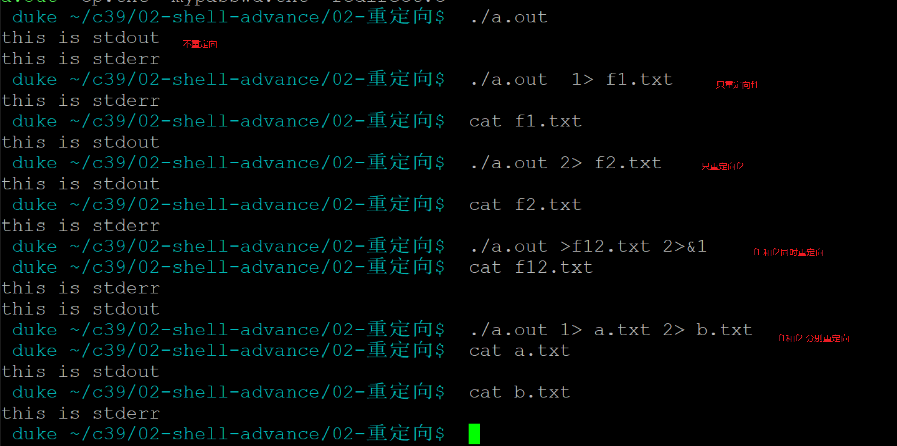
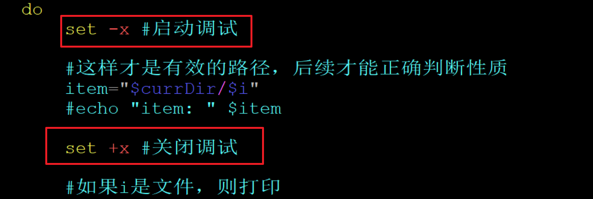
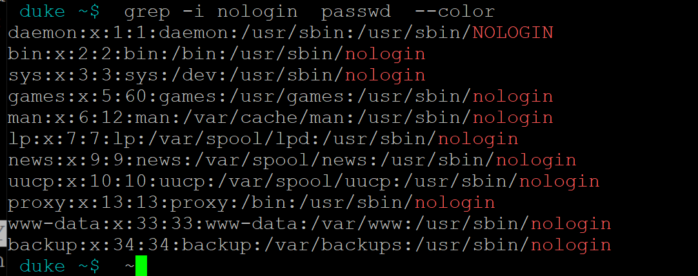
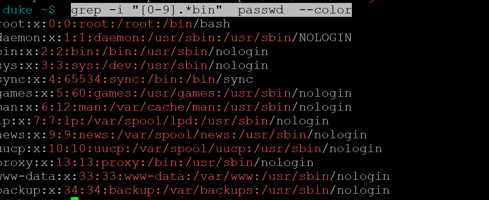
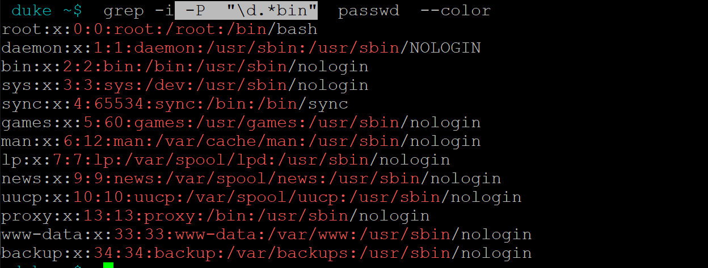
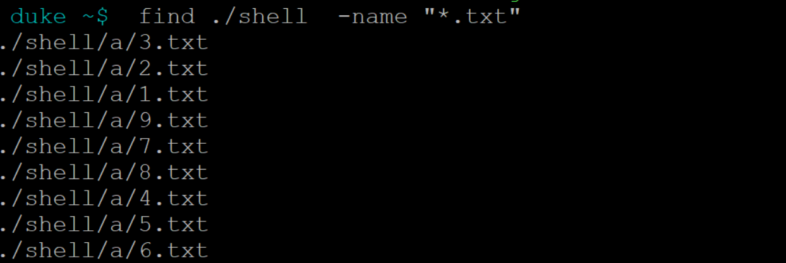
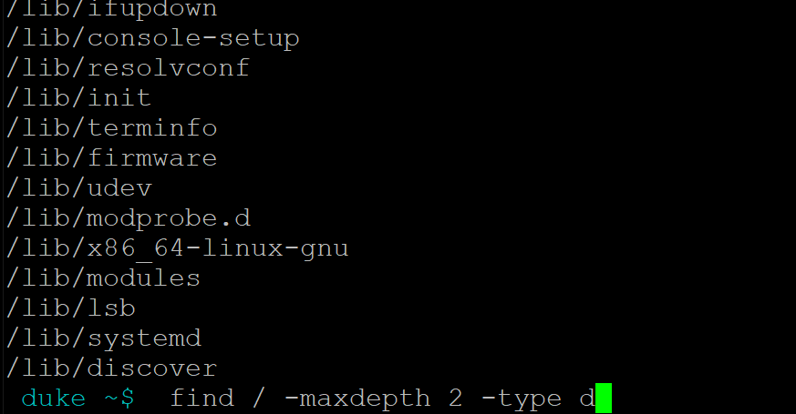

# 一、输入输出

## echo

1. 回声，用于打印输出工作
   1. -n： 可以不换行
   2. -e：对字符进行转义，\t    ===》 enable
   3. 


## printf

1.  printf "%d,%s\n" 10 "你好"
2. 注意10 和 “你好” 两个参数之间，没有逗号

3

## 管道|

1. 使用| 可以将多个命令拼接在一起

   ```sh
    cat /etc/passwd  | grep itcast | cut -d: -f4
   1000
   ```

2. 原理：将前一个命令的标准输出作为后一个命令的标准输入

3. 标准错误输出是不会被管道传递的

   ```sh
   cp | grep information.  # 这个是不生效的
   cp  --help | grep existing --color  #这个是正确用法
   ```

   

4. 并不是所有的命令都可以接受|的数据，比如说ls

   ```sh
     find ../../01-shell-basic/ | ls
   ```

5. 需求：实现一个接收管道输出的命令：读取标准输入，将标准输入的数据转成大写，然后输出：

   ```c
   #include<stdio.h>
   #include<ctype.h>
   
   int main()
   {
       int ch=getchar();
       while(ch != EOF)
       {
           putchar(toupper(ch));
           ch = getchar();
       }
   
       return 0;
   }
   ```

6. 经常与more和less使用
   1. more，只可以单向查阅
   2. less可以双向查阅
   3. ctrl + f(前)，ctrl+B（后）


## tee

作用之一：

1. 将标准输出重新输出到指定的文件

2. 公司服务器打印log，希望能够在屏幕上打印，同时保存到文件：

   ```sh
   ping www.baidu.com | tee ping.log
   ```

3. 如果想动态查看ping.log文件内容

   1. vim ping.log， 然后输入:e，可以随时刷新
   2. tail -f ping.log，动态刷新
   3. alias tailf=tail -f


作用之二：

当修改了一个文件很多内容，但是没有修改权限的时候，可以直接使用tee命令来激活sudo 权限，从而完成修改


## 重定向

1. cmd > 1.txt  ， 将输出写入到1.txt，每一次都是重新覆盖，等同于: cmd 1> 1.txt（常用）
2. cmd > > 1.txt，将输出追加到1.txt

3. > \>, >> 两者只能将标准输出重定向到文件，而标准错误输出无法直接写入

4. 案例：

   ```sh
   $  cp > cp.txt
   cp: missing file operand
   Try 'cp --help' for more information.
   
   cat cp.txt 返回空
   ```

4. 文件描述符：
   1. 标准输入文件描述符：0
   2. 标准输出文件描述符：1
   3. 标准错误输出文件描述符：2

5. 如果想将错误的信息重定向到文件，需要使用文件描述符2

   ```sh
   cp 2> cperr.txt  #2> 表示对错误信息重定向
   ```

6. ==如何将正确输出和错误输出都写入到一个文件中？(最常用)==

   ```sh
   cp > /tmp/cperr1.txt 2>&1
   ```

7. 写一段c代码，里面同时输出：stdout, stderr

   ```sh
   #include<stdio.h>
   
   int main()
   {
       //写一段c代码，里面同时输出：stdout, stderr
       fprintf(stdout, "this is stdout\n"); //fd 1
       fprintf(stderr, "this is stderr\n"); //fd 2
   
       return 0;
   }
   ```

   结果：

   


8. 使用重定向进行输入

   cmd < file

   ```sh
   cat < /etc/passwd
   ```

9. 其他：

   1. cmd < &fd
   2. cmd > &fd
   3. cmd < &-


# 二、函数

## 函数

1. ==没有参数列，没有返回值，return返回的是状态码，使用$?查看==

2. 定义函数：

   ```sh
   function test1()
   {
   	#这个return的值，表示这个函数之后之后返回的状态码，而不出返回值，
   	#不能通过a=test()来获取100值
   	#可以通过echo $?来获取
   	return 100
   }
   
   #function去掉
   test()
   {
   
   }
   #去掉括号 
   function test
   {
   
   }
   
   #function和()至少保留一个，否则无法识别成函数ss
   ```

   

   

3. 案例：

   ```sh
   #!/bin/bash
   
   function test1()
   {
       a=200
       #a=100
           #这个return的值，表示这个函数之后之后返回的状态码，而不出返回值，
           #不能通过a=test()来获取100值
           #可以通过echo $?来获取
       if [ $a -eq 100 ]; then
           return 0
       else
           echo "hello test1"
           return 100
       fi
   }
   #function去掉
   test2()
   {
           echo "hello test2"
   }
   #去掉括号
   function test3
   {
           echo "hello test3"
           #如果函数没有return值，那么最后一条执行命令的状态码，就是这个函数的状态码
   }
   
   
   #function和()至少保留一个，否则无法识别成函数ss
   
   v1=`test1`
   
   if [ $? -eq 0 ];then
       echo "test1执行成功! a=100"
   else
       echo "test1执行之后，a!=100"
   fi
   
   #echo "test1 的返回状态码:" $?
   #echo "v1 : " "$v1"
   
   test2
   test3
   ```

   


3. 小结：

   1. 执行状态$?看return的返回值，如果没有返回值，则以最后一条命令的返回值为准

      ```sh
      test2()
      {
      	echo "hello test2"
          cp  #echo $? 1
      }
      ```

   2. return修饰的状态码只能是数字

      ```sh
      function test3
      {
          echo "hello test3"
      
          #./functest.sh: line 26: return: beijing: numeric argument required
          return "beijing" #这是错误的用法，必须是数字
      }
      ```

4. 函数参数：

   1. 调用方法与命令一样，也是$1, $2 ..

      ```sh
      test4()
      {
          echo "test4 函数参数为: $1, $2"
      }
      
      test4 "hello" "world"
      
      ```

5. 案例：递归遍历指定目录的文件!

```sh
#!/bin/bash

#案例：递归遍历指定目录的文件!
#目录由用户通过命令行传入：

#./recursive.sh ..

recursive()
{
    #接收用户输入的目录
    #currDir="$1"
    local currDir="$1"
    echo "====> 当前目录为:" "$currDir"

    #遍历当前目录
    for i in `ls $currDir`
    do
        #这样才是有效的路径，后续才能正确判断性质
        #item="$currDir+"/"+$i"  <<=== 这是错误的，  /usr/+/+test.txt
        item="$currDir/$i"
        #echo "item: " $item

        #如果i是文件，则打印
        if [ -f "$item" ]; then
            echo "文件找到: $item"
        elif [ -d "$item" ];then
        #如果i是文件夹，则递归遍历
            echo "文件夹找到:" "$item"
            recursive $item
        else
            echo "未知文件:" "$item"
        fi
    done
}

#判读输入参数的个数
if [ $# -ne 1 ];then
    echo "Usage: recursive <文件目录>"
    exit
fi

recursive $1
```


## 调试

shell调试参数：

- -n 帮助我们快速检查脚本的语法，而不是逐条执行

  - 脚本如果很大，中间执行过程很长，如果不能实现发现脚本错误，会浪费时间

  - ```sh
     bash -n ./recursive.sh
    ```

  - 


- -x，执行脚本的同时将代码执行过程打印到屏幕，便于追踪

  - bash -x recursive.sh  ==》 作用于整个脚本

  - 可以在代码中，对指定的代码段进行调试  

    - set -x  ==> 启动调试

    - xxxx

    - set +x  ==> 停止调试

      

- -v，一边执行脚本，一边打印错误输出（很少用）


shift 8  ==> *， 快速定位当前光标所值单词（向下寻找,n）

shift 3 ==> #，  快速定位当前光标所值单词（向上寻找,n）


# 三、正则表达式

1. 以S开头的字符串

   1. ^： 可以限定一个字符开头 

   2. ```sh
      目标：ShelloShello world
      表达式：^Shello
      ```


2. 以数字结尾的字符串

   1. $:可以限定结尾
   2. 表示数字方式：
      1. [0123456789]
      2. [0-9]

   2. ```sh
      目标：helloworld9
      表达式：helloworld[0-9]$
      ```

      

3. 匹配空字符串(没有任何字符)

   1. ^$

4. 字符串只包含三个数字

   1. 三个数字：\[0-9\]\[0-9\]\[0-9\]

5. 字符串只有3到5个字母

   1. 字母表示：
      1. [a-zA-Z]， 中间不要加空格
      2. 三个到五个字母：[a-zA-Z]{3,5}
   2. 重复次数{m, n}： 
      1. 匹配前面修饰字符的次数，最少m次，最多n次

6.  匹配不是a-z的任意字符

   1. ^ 在[]内部的时候，表示取反（注意，不是限定开头）
   2. ^[^0-9\] :  以非数字开头的字符
   3. 内反，外头
   4. [^a-z\]    <<<===

7. 字符串有0到1个数字或者字母或者下划线

   1. 表示0-1的方法

      1. {0,1}
      2. ? : 表示0,1个

   2. [a-zA-Z0-9_]?

   3. ```sh
      内容
      hello
      hello1
      hello*
      
      正则：
      hello[a-zA-Z0-9_]?
      
      匹配结果：
      hello
      hello1
      hello
      ```

2. 字符串有1个或多个空白符号(\t\n\r等)

   1. \s  ==》 代表空格

   2. +：一个或多个

   3. ```h
      内容：hello      world
      
      正则：hello\s+world
      
      结果：hello      world
      ```

3. 字符串有0个或者若干个任意字符(除了\n)

   1.  .: 点，代表任意字符，除了\n

   2. *：星号，重复前一个字符0-n次

   3. 匹配任意字符，任意次数：通常做法，是：   .*   ==> 相当于通配符里面的 *

   4. ```sh
      内容：hello     asdfaasdfasdfadfasdfasdf asdfasdfasdf   world
      正则：hello.*world
      结果：hello     asdfaasdfasdfadfasdfasdf asdfasdfasdf   world
      ```

   5. .{,}  ==> 与 .*效果相同

4. 小结：

   1.  ?    ===> 重复前面一个字符0-1
   2. \+     ===> 重复前面一个字符1-n
   3. \*     ===> 重复前面一个字符0-n
   4. .     ===> 表示任意字符
   5. ^    ===> 限定以某个字符开头
   6. [^a-z] ===> 在方括号内，表示取反(非a-z的任意字符)
   7. $   ===> 限定以某个字符结尾
   8. 数字 ====》 [0123456789]  或[0-9]
   9. 字母 ===> [abcd]  [a-zA-Z]

5. 匹配0或任意多组ABC，比如ABC，ABCABCABC

   1. 使用()进行分组，组成新的匹配单元
   2. (ABC)*

6. 字符串要么是ABC，要么是123

   1. （ABC|123）

   2. ```sh
      内容：
      ABC
      ABCABCABCD 
      123456
      hellowlrd
      
      
      正则：（ABC|123）
      ```

7. 字符串只有一个点号 

   1. ^\\.$

8. 匹配十进制3位整数  ：

   1. 0~999 ， 5，  10 ， 200， 999
   2. 分段匹配：
      1. 一位数：
         1.  [0-9]
      2. 二位数：
         1. [1-9]\[0-9\]
      3. 三位数：
         1. \[1-9\][0-9]{2}
      4. 整合：
         1. ^ ([0-9]|[1-9]\[0-9\]{1,2})$

9. 匹配0-255的整数， ip地址

   1. 分段
      1. 一位：[0-9]
      2. 二位：[1-9]\[0-9\]
      3. 三位：
         - 100- 199
           - 1[0-9]{2}
         - 200-249
           - 2[0-4]\[0-9\]
         - 250-255
           - 25[0-5]
      4. 整合：
         - `^(([0-9]|[1-9][0-9]|1[0-9]{2}|2[0-4][0-9]|25[0-5])\.){3}([0-9]|[1-9][0-9]|1[0-9]{2}|2[0-4][0-9]|25[0-5])$`
         - 192.168.1.1

10. 匹配端口号

    1. 0~65536

11. email

    ```sh
    [\w!#$%&'*+/=?^_`{|}~-]+(?:\.[\w!#$%&'*+/=?^_`{|}~-]+)*@(?:[\w](?:[\w-]*[\w])?\.)+[\w](?:[\w-]*[\w])?
    ```


三种正则表达式：

1. 基础正则：（不使用）  ==》 +?* 都当成普通字符来处理

2. 扩展正则：（我们默认使用这个）==》 +?*  当成特殊字符

3. Perl正则：

   1. +？*是特殊字符

   2. \d ==》 数字 [0-9]

   3. \w ==> 字符[a-zA-Z] 

   4. 用法\d{3}\w    可以匹配：212c

      

# 四、其他命令

## sort（排序）

```sh
-f 忽略字符大小写
-n 按照数值比较
-t 分割字符
-k 指定分割之后比较的字段
-u 只显示一次
-r 反向排序
```

使用:分割之后，截取第三段，以数字的值进行比较，反向打印

```sh
 sort passwd -t: -k3 -n -r
```


## uniq（删除重复）

uniq.txt

```sh
xiaoliu 99 man 25
xiaowen 98 man 24
xiaoliu 99 man 25
```

去重方式，需要重复的两行挨着才能去重，一般和sort配合使用

```sh
cat uniq.txt | sort | uniq
```


## wc

-l: 统计文件的行数   <==最常用

-c:统计字符

-w:统计单词数量


```sh
 duke ~$  wc /etc/passwd -l    
32 /etc/passwd
 duke ~$  wc /etc/passwd -c
1694 /etc/passwd
 duke ~$  wc /etc/passwd -w
49 /etc/passwd
```


## grep

```sh
grep [options]
主要参数：  grep --help可查看
	-c：只输出匹配行的计数。
	-i：不区分大小写。
	-h：查询多文件时不显示文件名。
	-l：查询多文件时只输出包含匹配字符的文件名。
	-n：显示匹配行及 行号。
	-s：不显示不存在或无匹配文本的错误信息。
	-v：显示不包含匹配文本的所有行。
	--color=auto ：可以将找到的关键词部分加上颜色的显示。
	-r: 表示递归查询
```


-i 忽略大小写，NOLOGIN一行也打印了

```sh
grep -i nologin  passwd  --color
```




使用拓展正则[0-9].*

```sh
grep -i "[0-9].*bin"  passwd  --color
```




如果想使用Perl正则，需要指定-P开关

```sh
 grep -i -P  "\d.*bin"  passwd  --color
```




使用-r进行递归查询

```sh
grep -i -P  "\d.*bin"  *  --color  -r
```

```sh
cat /etc/passwd | grep root
```


## find

语法：

```sh
find pathname -options [-print -exec -ok ...]
```

1. 通过名字查找

```sh
find ./shell  -name "*.txt"
```



2. 通过权限查找

```sh
 find ./shell/ -perm 755
```

3. 通过类型查找

```sh
find ./shell -type f "*.txt"   #文件类型
find ./shell/ -type d -name "*.txt"  #文件夹类型
 
-type 查找某一类型的文件，诸如：
b - 块设备文件。
d - 目录。
c - 字符设备文件。
p - 管道文件。
l - 符号链接文件。
f - 普通文件。
```

4. 指定查找深度

```sh
 find / -maxdepth 2 -type d
```



5. 不区分文件名字大小写，使用-iname

```sh
 find ./shell -type f -iname "*.txt"
```


6. 对find查找到的文件，进行处理，使用

   1. -exec: 直接执行

      ```sh
      find ./shell -type f -iname "*.txt" -exec rm {} \;
      {} 替换为传入的数据
      \; 表示命令结束
      ```

   2. -ok：逐个确认

      ```sh
      find ./shell -type f -iname "*.txt" -ok rm {} \;
      ```

7. 按照日期查询

   ```sh
   -atime : 访问时间
   -mtime: 修改时间， 内容修改
   -ctime: 不是创建时间，而是状态修改时间，权限，所有者
   ```

   ```sh
    find ./shell/ -mtime +1   
    -1: -n表示在n天之内修改的
    +1: +n表示在n天以前修改的
   ```

   

参数列表：

```sh
-name 按照文件名查找文件。
-perm 按照文件权限来查找文件。

-size n：[c] 查找文件长度为n块的文件，带有c时表示文件长度以字节计。
-depth 在查找文件时，首先查找当前目录中的文件，然后再在其子目录中查找。


-prune 使用这一选项可以使find命令不在当前指定的目录中查找，如果同时使用-depth选项，那么-prune将被
find命令忽略。
-user 按照文件属主来查找文件。
-group 按照文件所属的组来查找文件。
-mtime -n +n 按照文件的更改时间来查找文件，-n表示文件更改时间距现在n天以内，+n表示文件更改时间距现在
n天以前。find命令还有-atime和-ctime 选项，但它们都和-m time选项。
-nogroup 查找无有效所属组的文件，即该文件所属的组在/etc/groups中不存在。
-nouser 查找无有效属主的文件，即该文件的属主在/etc/passwd中不存在。
-newer file1 ! file2 查找更改时间比文件file1新但比文件file2旧的文件。
-fstype 查找位于某一类型文件系统中的文件，这些文件系统类型通常可以在配置文件/etc/fstab中找到，该配
置文件中包含了本系统中有关文件系统的信息。
-mount 在查找文件时不跨越文件系统mount点。
-follow 如果find命令遇到符号链接文件，就跟踪至链接所指向的文件。
```


```sh
pathname: find命令所查找的目录路径。例如用.来表示当前目录，用/来表示系统根目录，递归查找。
-print： find命令将匹配的文件输出到标准输出。
-exec： find命令对匹配的文件执行该参数所给出的shell命令。相应命令的形式为'command' {} \;，注意{}内部无空格，和\；之间含有一个空格分隔符。
-ok： 和-exec的作用相同，只不过以一种更为安全的模式来执行该参数所给出的shell命令，在执行每一个命令之前，都会给出提示，让用户来确定是否执行。只有用户明确输入y才会执行后边的语句
```


head、tail、scp、xargs、sed、awk