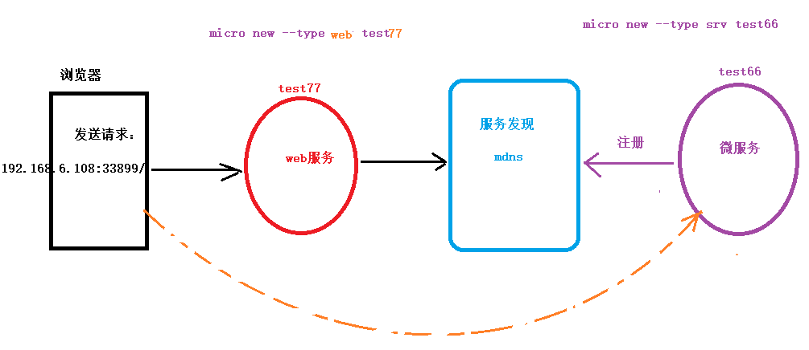
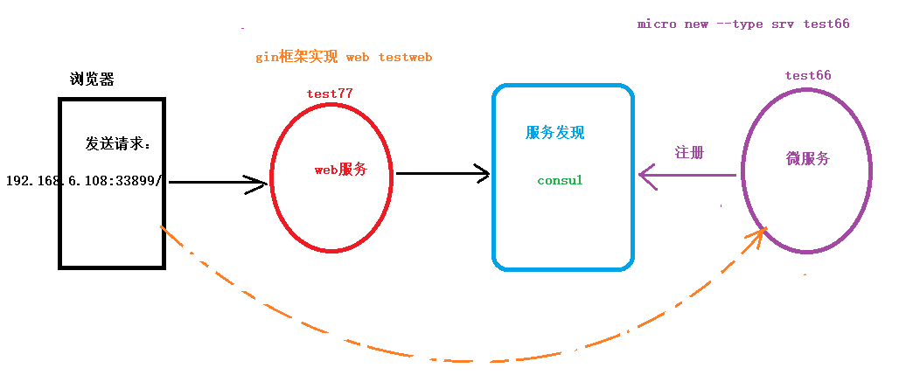
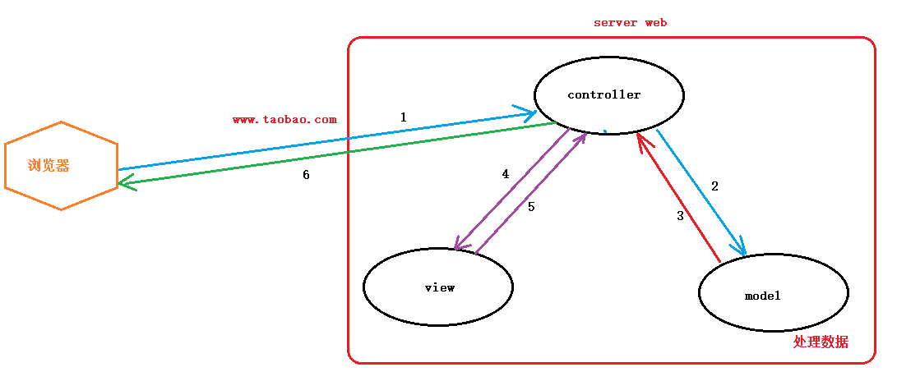

# go-Micro 框架


## 创建 micro 服务

命令：micro new --type srv test66

框架默认自带服务发现：mdns。

使用consul服务发现：

	1. 初始consul服务发现： consulReg := consul.NewRegistry()
 	2. 在 NewService 中 添加 服务。 micro.Registry(consulReg )，


## 使用 go-micro框架 创建 客户端

命令：micro new --type web test77

### 补充 http 相关知识：

- 路由器：资源分发
- 路由：请求分发。
    - service.HandleFunc("/test77/call", handler.Test77Call)
        - 将 /test77/call 这个请求，通过 回到函数 Test77Call() 处理。
- URL：
    - 组成：https://ip+port/资源路径
        - https://ip+port/   找到 pc机，找到 对应进程
        - 资源路径：在代码中，称之为路由。
    - “/ ” : 代表 主机上进程 对应的默认资源。
        - http协议，自动找当前目录下的 index.html 文件，做默认页面。

### go-micro 框架 测试使用 分析图



# gin 框架

go常见的web框架：gin、beego、echo、Iris 。。。

### 实现简单的 web 

http 常用方法与 数据库访问 一一对应。

- GET —— 查 —— 获取数据
- Post —— 增 —— 增加数据
- Put —— 改 —— 更新数据
- Delete —— 删 —— 删除数据

​	

### 使用 gin 框架创建最简单的web 

```go

func main()  {
	// 1. 初始化路由 -- 官网:初始化 web 引擎
	router := gin.Default()

	// 2. 做路由匹配
	router.GET("/", func(context *gin.Context) {
		context.Writer.WriteString("hello world!")
	})

	// 3. 启动运行
	router.Run(":8080")
}
```


### gin 框架的客户端 与 微服务 对接

1.  封装回调函数， 给 router.Get() 设置

2.  拷贝 微服务的 “ 密码本” protobuf 到  web 中

3.  修改 protobuf文件的 包名。  test66别名  “test66web/proto/test66”

4.  实现 回调函数：

    1. 初始化客户端。    microClient := NewTeset66Sevice(服务名，client.DefaultClient)

    2. 调用远程服务。    resp, err := microClient.Call(context.TODO, &test66.Request{

        ​						       })

    3. 将 返回的 数据， 显示到 浏览器。 context.Writer.WriteString(resp.Msg);

```go
package main

import (
	"github.com/gin-gonic/gin"
	"fmt"
	test66 "test66web/proto/test66"     // test66 为包的别名.
	"github.com/micro/go-micro/client"
	"context"
)

func CallRemote(ctx *gin.Context)  {
	// 1. 初始化客户端
	microClient := test66.NewTest66Service("go.micro.srv.test66", client.DefaultClient)
	fmt.Println()

	// 2. 调用远程服务
	resp, err := microClient.Call(context.TODO(), &test66.Request{
		Name:"xiaowang",
	})
	if err != nil {
		fmt.Println("call err:", err)
		return
	}
	// 为了方便查看, 在打印之前将结果返回给浏览器
	ctx.Writer.WriteString(resp.Msg)

	fmt.Println(resp, err)
}

func main()  {
	// 1. 初始化路由 -- 官网:初始化 web 引擎
	router := gin.Default()

	// 2. 做路由匹配
	router.GET("/", CallRemote)

	// 3. 启动运行
	router.Run(":8080")
}


```


### 指定 consul 服务发现到 go-micro 服务和 gin 框架客户端中

- mdns服务发现: （组播）支持的服务，必须是本地服务， 局域网内的服务。

#### 修改 go-micro 微服务

1. consulReg := consul.NewRegistry()   初始化 consul服务发现
2. 添加 服务 service := micro.NewService(
    		micro.Name("go.micro.srv.test66"),
        		micro.Registry(consulReg),
        		micro.Version("latest"),
        	)

3. 在命令行，执行 consul agent -dev


#### 修改 gin 框架 web服务 (客户端)

1.  consulReg := consul.NewRegistry()   初始化 consul服务发现
2.  microClinet := micro.NewService( micro.Registry(consulReg ) )
3.  test66.NewTest66Service(“服务名”，microClinet.Client() )


测试：浏览器键入： 192.168.6.108:8080  ——> hello xiaowang 




# REST 

REST全称是Representational State Transfer：  表述性 状态 转义

本质：一种代码设计风格。  web开发中常用。——遵循风格！

使用：一般以 http 4 种请求方法， 来确定对某一资源（URI：标识符。名词）的 固定操作。

- 获取数据：GET
- 添加数据：POST
- 修改数据：PUT
- 删除数据：Delete

​		满足 REST 设计风格的， 称之为 “RESTful”

​	

# MVC

- 是一种常见的 “代码组织架构”， 可以在开发中，对数据进行处理并解耦。
    - model：模型。 处理数据库相关的文件。
    - veiw：视图。处理显示相关的文件。 网站：html
    - controller：控制器。处理具体业务！  联动 m 和 v
- MVC 与语言无关！是常见的 代码组织架构。




# 项目准备

1. 准备项目环境。
    1. 创建项目目录  web、service
    2. 在 web 端 使用 MVC
    3. 创建项目常用目录： conf 配置文件、utils 工具类、bin可执行文件、test测试目录
    4. 导入 异常处理error.go
    5. 导入前端资源 html/ 到 view/ 中

2. 开发项目
    1. 开发 微服务端
    2. 开发 web 服务（客户端）

### http协议错误

5 类：

1. 1xx	   100		请求成功，需要继续发送请求
2. 2xx       200   201  202    请求被成功接收。
3. 3xx       300 301               请求的资源，指定到对应的 URI上
4. 4xx       404  403              请求端错误
5. 5xx       500 501  502      服务端错误

### 网站开发形式：

1. 前后端不分离
    - 前端只负责页面创建，不负责加载数据。
    - 后台负责主要业务书写，数据操作、加载。—— 需要后端会 web。 css 、js、h5 
2. 前后端分离
    - 前端负责页面创建 和 数据的加载。
    - 后端只负责数据处理。  —— 节省时间：服务器优化     1）健壮性 2）并发性。


# 获取 session 

1.  在 web/main.go 中 ， 跟据 gin 框架 使用static() , 设置访问路径
2. F12 浏览器中，查看 NetWork 中 Headers 和  Respose。 得到 url
3. 查看 《接口文档.doc》, 获取 url 、错误码、错误处理函数。
4. 在 web/ 下 遵循 MVC 设计模式创建  controller 目录。添加 user.go
5. 根据 《接口文档.doc》实现错误函数。
    1. resp[“errno”]
    2. resp[“errmsg”]
    3. ctx.Json(200, resp)  // 将 错误消息，进行序列化。返回给浏览器。
6.  url寻址时，都是从 “/‘’ 开始， 产生歧义
    - router.Static(“/”)    --- 修改为： router.Static(“/home”)

7. 浏览器测试： IP:8080/home 