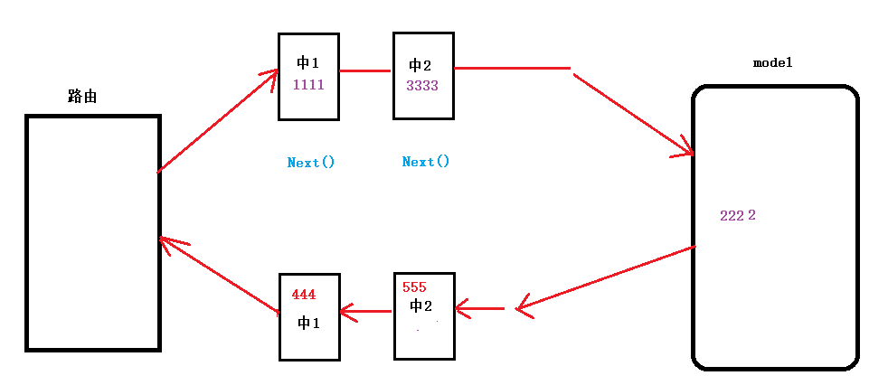
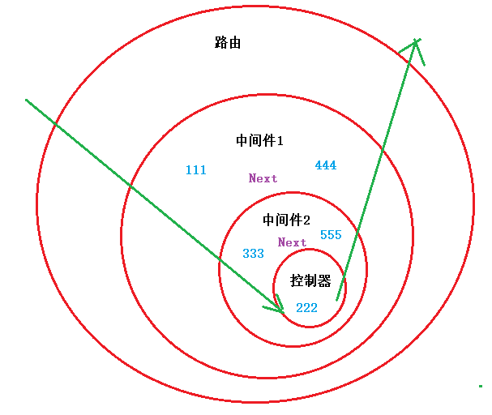

# 用户登录

## 修改 GetSession 方法

- 之前实现的 web/controller/user.go 中的 GetSession() 方法，是一个伪实现，没有真正的获取 Session。 

- 从 容器中， 真正的获取 Session，展示给浏览器。

    ```go
    func GetSession(ctx *gin.Context)  {
    	resp := make(map[string]interface{})
    
    	// 获取 Session 数据
    	s := sessions.Default(ctx)		// 初始化 Session 对象
    	userName := s.Get("userName")
    
    	// 用户没有登录.---没存在 MySQL中, 也没存在 Session 中
    	if userName == nil {
    		resp["errno"] = utils.RECODE_SESSIONERR
    		resp["errmsg"] = utils.RecodeText(utils.RECODE_SESSIONERR)
    	} else {
    		resp["errno"] = utils.RECODE_OK
    		resp["errmsg"] = utils.RecodeText(utils.RECODE_OK)
    
    		var nameData struct{
    			Name string `json:"name"`
    		}
    		nameData.Name = userName.(string)		// 类型断言
    		resp["data"] = nameData
    	}
    
    	ctx.JSON(http.StatusOK, resp)
    }
    ```

    

## 退出登录

- 将 Session 数据删除！保存修改！

    ```go
    // 退出登录
    func DeleteSession(ctx *gin.Context)  {
    	resp := make(map[string]interface{})
    
    	// 初始化 Session 对象
    	s := sessions.Default(ctx)
    	// 删除 Session 数据
    	s.Delete("userName")		// 没有返回值
    	// 必须使用 Save 保存
    	err := s.Save()				// 有返回值
    
    	if err != nil {
    		resp["errno"] = utils.RECODE_IOERR	// 没有合适错误,使用 IO 错误!
    		resp["errmsg"] = utils.RecodeText(utils.RECODE_IOERR)
    
    	} else {
    		resp["errno"] = utils.RECODE_OK
    		resp["errmsg"] = utils.RecodeText(utils.RECODE_OK)
    	}
    	ctx.JSON(http.StatusOK, resp)
    }
    ```

    

# 获取用户基本信息

1.  登录成功后，点击 “用户名(手机号)” 进入 用户页面。 尚未显示用户 “用户名”、“手机号” 用户信息。

2.  web/main.go 中 添加 路由回调。—— 参考 《接口文档.doc》

    ```go
    r1.GET("/user", controller.GetUserInfo)
    ```

3. web/controller/user.go 中添加 GetUserInfo 函数， 并实现

    ```go
    // 获取用户基本信息
    func GetUserInfo(ctx *gin.Context)  {
    }
    ```

4. 实现：

    1.  准备 存储输出结果(成功、失败) 的 数据结构：

        ```go
        resp := make(map[string]interface{})
        defer ctx.JSON(http.StatusOK, resp)
        ```

    2. 获取 Session, 得到 当前 用户信息

        ```go
        s := sessions.Default(ctx)  // Session 初始化
        userName := s.Get("userName")	// 根据key 获取Session
        
        if userName == nil {		// 用户没登录, 但进入该页面, 恶意进入.
            resp["errno"] = utils.RECODE_SESSIONERR
            resp["errmsg"] = utils.RecodeText(utils.RECODE_SESSIONERR)
            return		// 如果出错, 报错, 退出
        }
        ```

    3. 访问 MySQL数据库， 按照 userName ， 提取用户信息

        ```go
        --- 在 web/model/modleFunc.go 中 创建 GetUserInfo() 函数，并实现。
        // 获取用户信息
        func GetUserInfo(userName string) (User, error) {
        	// 实现SQL: select * from user where name = userName;
        	var user User
        	err := GlobalConn.Where("name = ?", userName).First(&user).Error
        	return user, err
        }
        
        上述函数，也可以写成。---- go语法写。
        func GetUserInfo(userName string) (user User, err error) {
        	// 实现SQL: select * from user where name = userName;
        	err = GlobalConn.Where("name = ?", userName).First(&user).Error
        	return 
        }
        ```

    4. 调用 GetUserInfo 获取用户信息。

        ```go
        // 根据用户名, 获取 用户信息  ---- 查 MySQL 数据库  user 表.
        user, err := model.GetUserInfo(userName.(string))  // 类型断言，传参
        if err != nil {
            resp["errno"] = utils.RECODE_DBERR
            resp["errmsg"] = utils.RecodeText(utils.RECODE_DBERR)
            return		// 如果出错, 报错, 退出
        }
        ```

    5. 参照 《接口文档.doc》 中 发送成功消息字段，实现

        ```go
        resp["errno"] = utils.RECODE_OK
        resp["errmsg"] = utils.RecodeText(utils.RECODE_OK)
        
        temp := make(map[string]interface{})
        temp["user_id"] = user.ID
        temp["name"] = user.Name
        temp["mobile"] = user.Mobile
        temp["real_name"] = user.Real_name
        temp["id_card"] = user.Id_card
        temp["avatar_url"] = user.Avatar_url
        
        resp["data"] = temp
        
        // 前面已经添加 defer ctx.JSON() 
        ```

5. 测试：
    1. 重启  web/main.go 
    2. 刷新 浏览器，看到：用户名：xxxx  手机号 ： xxxxx   。 


# 更新用户名

1. web/main.go 添加 路由回调

    ```go
    r1.PUT("/user/name", controller.PutUserInfo)
    ```

2. web/controller/user.go 定义，实现函数 PutUserInfo

    ```go
    func PutUserInfo(ctx *gin.Context) {
    	// 获取当前用户名
    	// 获取新用户名
    	// 更新用户名
    }
    ```
    
3. 获取 当前用户名

    ```go
    s := sessions.Default(ctx)			// 初始化Session 对象
    userName := s.Get("userName")
    ```

    

4. 获取 新用户名

    ```go
    // 获取新用户名		---- 处理 Request Payload 类型数据. Bind()
    var nameData struct {
        Name string `json:"name"`
    }
    ctx.Bind(&nameData)
    ```

    

5. 更新 用户名

    1.  更新 MySQL 数据库

        ```go 
        --- 在 web/model/modelFunc.go 实现
        // 更新用户名
        func UpdateUserName(newName, oldName string) error {
        	// update user set name = 'itcast' where name = 旧用户名
        	return GlobalConn.Model(new(User)).Where("name = ?", oldName).Update("name", newName).Error
        }
        ```

    2. 调用 model 中的 UpdateUserName() 函数

        ```go
        // 更新用户名
        resp := make(map[string]interface{})
        defer ctx.JSON(http.StatusOK, resp)
        
        // 更新数据库中的 name
        err := model.UpdateUserName(nameData.Name, userName.(string))
        if err != nil {
            resp["errno"] = utils.RECODE_DBERR
            resp["errmsg"] = utils.RecodeText(utils.RECODE_DBERR)
            return
        }
        ```

    3.  更新 Session 

        ```go
        // 更新 Session 数据
        s.Set("userName", nameData.Name)
        err = s.Save()		// 必须保存
        if err != nil {
            resp["errno"] = utils.RECODE_SESSIONERR
            resp["errmsg"] = utils.RecodeText(utils.RECODE_SESSIONERR)
            return
        }
        resp["errno"] = utils.RECODE_OK
        resp["errmsg"] = utils.RecodeText(utils.RECODE_OK)
        resp["data"] = nameData
        ```

6. 测试：

    - 修改以后的用户名，保存在 Session中， 后退页面也能看到！


# 中间件 (middleWare)

- 中间件，对以后的路由全部生效。
    - 设置好中间件以后，所有的路由都会使用这个中间件。
    - 设置以前的路由，不生效。


## 什么是 “中间件”：

- 早期：
    - 用于 系统 和 应用之间。
    - 中间件： 内核 —— 中间件 ——  用户应用

- 现在：
    - 用于 两个模块之间的 功能 软件(模块)
    - 中间件：—— 承上启下。  前后台开发： 路由 ——> 中间件 (起过滤作用) ——> 控制器
    - 特性：对 “中间件”指定位置 ， 以下的路由起作用！以上的，作用不到。

### 中间件类型

- gin 框架规定：中间件类型为：gin.HandlerFunc 类型。

- gin.HandlerFunc 类型。就是 ：

    ```go
    func (c *gin.Context) { 
        
    }
    ```

    ```go
    // 示例：
    func Logger() gin.HandlerFunc {
        return func (c *gin.Context) {   
        }
    }
    r.Use(Logger())		// 传 “中间件” 做参数。
    ```

### 中间件测试

- 中间件使用的 3 个知识：

#### Next()

- 表示，跳过当前中间件剩余内容， 去执行下一个中间件。 当所有操作执行完之后，以出栈的执行顺序返回，执行剩余代码。

- ```go
    
    // 创建中间件
    func Test1(ctx *gin.Context)  {
    	fmt.Println("1111")
    	ctx.Next()
    	fmt.Println("4444")
    }
    // 创建 另外一种格式的中间件.
    func Test2() gin.HandlerFunc {
    	return func(context *gin.Context) {
    		fmt.Println("3333")
    		context.Next()
    		fmt.Println("5555")
    	}
    }
    func main()  {
    	router := gin.Default()
    
    	// 使用中间件
    	router.Use(Test1)
    	router.Use(Test2())
    
    	router.GET("/test", func(context *gin.Context) {
    		fmt.Println("2222")
    		context.Writer.WriteString("hello world!")
    	})
    
    	router.Run(":9999")
    }
    ```

#### return 

- 终止执行当前中间件剩余内容，执行下一个中间件。 当所有的函数执行结束后，以出栈的顺序执行返回，但，不执行return后的代码！

    ```go
    // 创建中间件
    func Test1(ctx *gin.Context)  {
    	fmt.Println("1111")
    	
    	ctx.Next()
    
    	fmt.Println("4444")
    }
    // 创建 另外一种格式的中间件.
    func Test2() gin.HandlerFunc {
    	return func(context *gin.Context) {
    		fmt.Println("3333")
    
    		return
    		context.Next()
    
    		fmt.Println("5555")
    	}
    }
    func main()  {
    	router := gin.Default()
    
    	// 使用中间件
    	router.Use(Test1)
    	router.Use(Test2())
    
    	router.GET("/test", func(context *gin.Context) {
    		fmt.Println("2222")
    		context.Writer.WriteString("hello world!")
    	})
    
    	router.Run(":9999")
    }
    ```

    

#### Abort()

-  只执行当前中间件， 操作完成后，以出栈的顺序，依次返回上一级中间件。

    ```go
    // 创建中间件
    func Test1(ctx *gin.Context)  {
    	fmt.Println("1111")
    
    	ctx.Next()
    
    	fmt.Println("4444")
    }
    // 创建 另外一种格式的中间件.
    func Test2() gin.HandlerFunc {
    	return func(context *gin.Context) {
    		fmt.Println("3333")
    
    		context.Abort()
    
    		fmt.Println("5555")
    	}
    }
    func main()  {
    	router := gin.Default()
    
    	// 使用中间件
    	router.Use(Test1)
    	router.Use(Test2())
    
    	router.GET("/test", func(context *gin.Context) {
    		fmt.Println("2222")
    		context.Writer.WriteString("hello world!")
    	})
    
    	router.Run(":9999")
    }
    
    ```

    






### 中间件测试业务时间：

```go
// 创建中间件
func Test1(ctx *gin.Context)  {
	fmt.Println("1111")

	t := time.Now()

	ctx.Next()

	fmt.Println(time.Now().Sub(t))
}

// 创建 另外一种格式的中间件.
func Test2() gin.HandlerFunc {
	return func(context *gin.Context) {
		fmt.Println("3333")
        context.Abort()		// 将 Abort() 替换成 Next()， 反复测试，获取时间差！
		fmt.Println("5555")
	}
}
func main()  {
	router := gin.Default()

	// 使用中间件
	router.Use(Test1)
	router.Use(Test2())

	router.GET("/test", func(context *gin.Context) {
		fmt.Println("2222")
		context.Writer.WriteString("hello world!")
	})

	router.Run(":9999")
}
```


## 小结

- 2种 书写格式：（见 前面笔记）
- 3个 操作函数/关键字： Next()、return、Abort()
- 作用域：作用域 以下 的路由。（ 对以上的 路由 无效！）


# 项目中使用中间件

1. 在 web/main.go 中 创建 中间件。

    ```go
    func LoginFilter() gin.HandlerFunc {
    	return func(ctx *gin.Context) {
    		// 初始化 Session 对象
    		s := sessions.Default(ctx)
    		userName := s.Get("userName")
    
    		if userName == nil {
    			ctx.Abort()			// 从这里返回, 不必继续执行了
    		} else {
    			ctx.Next()			// 继续向下
    		}
    	}
    }
    ```

2. 在 所有需要进行 Session 校验操作之前， 添加、使用这个中间件。

    ```go
    // 添加路由分组
    r1 := router.Group("/api/v1.0")
    {
        r1.GET("/session", controller.GetSession)
        r1.GET("/imagecode/:uuid", controller.GetImageCd)
        r1.GET("/smscode/:phone", controller.GetSmscd)
        r1.POST("/users", controller.PostRet)
        r1.GET("/areas", controller.GetArea)
        r1.POST("/sessions", controller.PostLogin)
    
    r1.Use(LoginFilter())  //以后的路由,都不需要再校验 Session 了. 直接获取数据即可!
    
        r1.DELETE("/session", controller.DeleteSession)
        r1.GET("/user", controller.GetUserInfo)
        r1.PUT("/user/name", controller.PutUserInfo)
    }
    ```


# 用户头像
1.  登录成功后，点击 “修改” 进入 “个人信息”页面。点击 “选择文件” ， 在系统选择一张图片作为头像。F12查看， 会在 Header 中， 看到 “avatar” 错误。

2.  web/main.go 中 添加 路由回调。—— 参考 《接口文档.doc》

    ```go
    r1.GET("/user/avatar", controller.PostAvatar)
    ```

3. web/controller/user.go 中添加 GetUserInfo 函数， 并实现

    ```go
    // 上传头像
    func PostAvatar(ctx *gin.Context)  {
    }
    ```

4. 实现 PostAvatar 函数。 ———— 测试 gin 框架上传文件函数。

    ```go
    func PostAvatar(ctx *gin.Context) {
    	// 获取图片文件, 静态文件对象
    	file, _ := ctx.FormFile("avatar")
    	// 上传文件到项目中
    	err := ctx.SaveUploadedFile(file, "test/"+file.Filename)
    	fmt.Println(err)
    }
    ```

    可以将 头像，上传到 test/ 目录中。 


- 课后作业：
    - 看 《fastdfs.pdf》课件！ 配置 fastDFS、 Nginx 相应的环境。